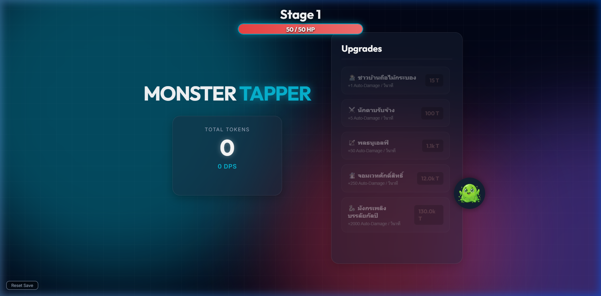

<div align="center">

# 👾 Monster Tapper

### Action-Packed Idle Clicker Web Game with Boss Battles

[](https://romeototo.github.io/monster-tapper/)
[](LICENSE)



</div>

---

## 📖 About

**Monster Tapper** is an action-packed idle clicker game where you battle through stages of increasingly powerful monsters and epic bosses. Tap to deal damage, earn tokens, hire heroes, and build your team to defeat the toughest creatures!

## ✨ Features

- ⚔️ **Tap-to-Attack** — Click monsters to deal damage and earn tokens
- 🐉 **Boss Battles** — Face epic bosses with timed challenges
- 🦸 **Hero System** — Recruit 5 unique heroes with auto-damage abilities
- 📈 **Stage Progression** — Battle through increasingly difficult stages
- 💰 **Token Economy** — Earn and spend tokens on powerful upgrades
- 🎨 **Dynamic Visuals** — Vibrant gradient backgrounds with smooth animations
- 💾 **Save Progress** — Game state saved to localStorage
- 📱 **Mobile Friendly** — Responsive design for all devices

## 🛠️ Tech Stack


- **Frontend:** Vanilla HTML5, CSS3, JavaScript
- **Styling:** Dark/gradient theme with glassmorphism effects
- **Assets:** Custom monster sprites and boss images
- **Hosting:** GitHub Pages

## 🚀 Play

### Online
👉 **[Play Now — romeototo.github.io/monster-tapper](https://romeototo.github.io/monster-tapper/)**

### Local
```bash
git clone https://github.com/romeototo/monster-tapper.git
cd monster-tapper
# Open index.html in your browser
```

## 🎯 How to Play

1. **Tap** the monster to deal damage
2. **Defeat monsters** to earn tokens
3. **Hire heroes** for automatic damage per second
4. **Fight bosses** at milestone stages (timed battles!)
5. **Upgrade heroes** to increase their power
6. **Progress** through ever-harder stages

## 🦸 Heroes

| Hero | Auto-Damage | Cost |
|------|------------|------|
| ชาวบ้านถือไม้กระบอง | +1 DPS | 15 T |
| นักดาบรับจ้าง | +5 DPS | 100 T |
| พลธนูเอลฟ์ | +50 DPS | 1.1k T |
| จอมเวทศักดิ์สิทธิ์ | +250 DPS | 12k T |
| มังกรเพลิงบรรลัยกัลป์ | +2000 DPS | 130k T |

## 📄 License

This project is licensed under the [MIT License](LICENSE).

---

<div align="center">

**Made with ❤️ by [RoMEoTOTO](https://github.com/romeototo)**

[](https://x.com/RoMeoT0T0)
[](https://github.com/romeototo)

</div>
